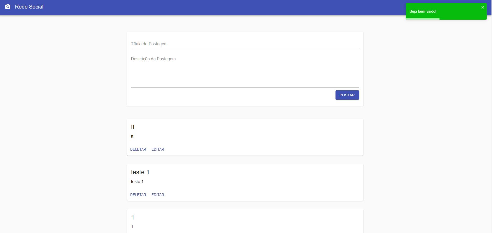
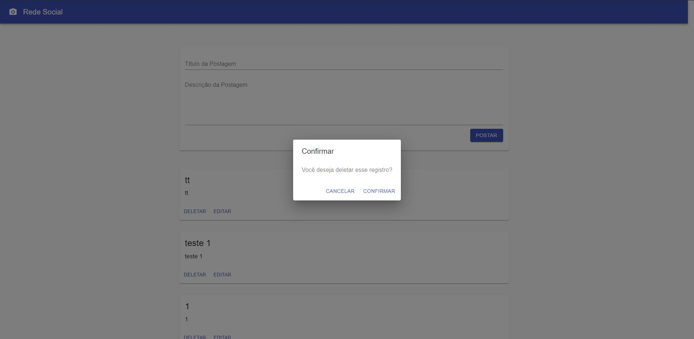
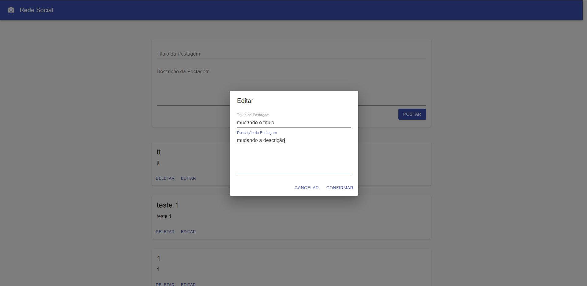

# Rede Social com React e Json Server

Este projeto tem como objetivo mostrar como utilizar o Json Server com o React para criar um aplicativo de rede social simples.
Esse projeto é utilizado para ensinar iniciantes a aprender react com uma fake api, segue abaixo as técnicas abordadas:

- [x] React Hooks
- [x] Utilização do Axios
- [x] Modularização de componentes
- [x] Utilização de Json Server
- [x] Material UI
- [x] Styled Components
- [x] React Router

Ainda serão abordadas as seguintes técnicas:

- [ ] Utilização de React Context:
- [ ] Typescript

### Pré-requisitos antes de Rodar

* `npm i`
* `npm install -g json-server`

### Pré-requisitos para Rodar

#### 1) Rodar o Json Server:

Para rodar o projeto, você precisa primeiramente acessar a pasta `api-fake`
e rodar o seguinte comando: 
#### `json-server --watch db.json`

Obs: o json-server irá rodar na porta `http://localhost:3000`

#### 2) Rodar o projeto React:

#### `npm start`

Obs: o react irá rodar na porta `http://localhost:3001`

#### Screenshots 

